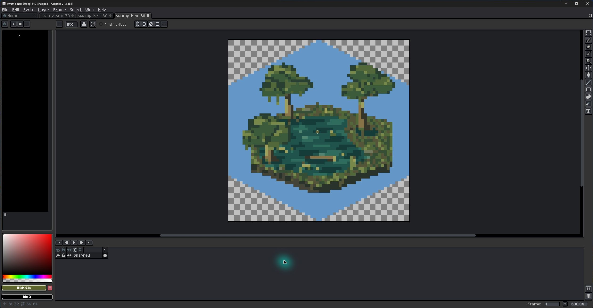

# QA record and manual checklist

Verification date: **2026-09-10**. Environment: Windows x64, Aseprite **1.3.18.5-x64**, Rust **1.98.1**. Engine source/Cargo files and the upstream LICENSE match baseline `ae20461f60fb39e75d15f184bab1ebec1219511c` without changes.

## Automated results

All suites passed using `scripts/smoke-test.ps1 -AsepritePath ...`:

- **5 existing Rust tests**, locked release build and CLI help.
- A transparent fixture processed by the packaged executable and decoded as PNG.
- **14 settings checks**, **16 output checks**, **13 native integration checks**.
- **Extracted-package end-to-end check**, using shipping Lua modules and the bundled executable from a directory containing spaces.
- Archive root/layout, Windows x64 executable, upstream LICENSE identity, source/binary metadata, dependency notices and shipping-preset exclusion.
- PE/import inspection confirms a static C runtime with no separate VCRUNTIME/MSVCP/UCRT DLL requirement.

The real Rust executable is used for successful integration cases. Error simulations cover a successful exit with no output, an unsuccessful exit with an output file, and an output-stage failure. Unsupported platform cases are simulated platform flags, not tests on those operating systems.

The checked-in swamp artwork also passed through the complete pipeline: 640 x 640 source; 126 x 122 Auto/16-color native output; 67 x 68 Manual-10/32-color native output; both fitted to 64 x 64 with nearest-neighbor. All saved images retain visible pixels and transparent regions without antialiasing. Source bytes, dirty state, undo count and file checksum stay unchanged. These native dimensions are observations, not guarantees.

## Manual application checklist

`GUI` means observed in the installed extension. `Automated` means exercised in Aseprite's batch Lua runtime; it does not claim a corresponding mouse-driven test.

| Check | Result and evidence |
| --- | --- |
| Install `.aseprite-extension` | GUI: archive installed through Preferences > Extensions and appears as Pixel Snapper; Aseprite generated its installer record. |
| Update an installed archive | GUI: Aseprite upgraded the packaged development candidate to 0.1.0 successfully. Installed Lua matches the final source; saved Fit + Pad dimensions, hex checkbox, alpha choice and Background RGB survived. |
| Earlier manual installation migration | GUI: update initially reported missing `__info.json`. Backed up the manual installation outside the extension directory, installed normally and restored `__pref.lua` while Aseprite was closed. Generic settings restored after restart. |
| Sprite menu command | GUI: Pixel Snapper appears in the Sprite menu and opens the complete dialog on the swamp image. No-sprite disabling was also verified in earlier GUI QA and the command's batch enable guard is tested. |
| Shipping presets | GUI and automated: exactly Generic / Detected Grid and Custom. Scaleweave definitions absent from the archive. |
| Generic Auto/Auto palette | GUI: Snap opens a new unsaved 126 x 122 transparent swamp sprite with one Snapped layer. Original remains open at 640 x 640. |
| Preset defaults and customization | GUI: Generic resets Native defaults; changing sizing marks it customized and enables dimensions. Earlier development GUI verified Terrain/Feature dropdown defaults. Automated: copying/default isolation and Custom retention. |
| Manual pixel size | Automated: positive integer override reaches the real CLI; malformed/fractional/out-of-range values fail validation. GUI field enabling was verified during earlier development QA. |
| Current/custom palette | Automated: both invoke the real CLI, skip transparent palette entries appropriately and produce RGB values from the requested palette. Earlier GUI verified custom field enabling and empty-palette alert. |
| Indexed/grayscale input | Automated: independent composited RGBA export and transparency. |
| Native/Exact/Fit + Pad/Crop | Automated: exact RGBA mapping, nearest-neighbor up/down scaling, odd centering, extreme aspect ratios, clipping/padding and pipeline order. |
| Terrain 64 (development) | Automated: preset produces 64 x 64 with preserved alpha and a pointy hex mask. Pixel tests verify symmetry, transparent exterior, no black outline and no added smoothing. |
| Feature 64 (development) | Automated: preset produces transparent 64 x 64 with no forced mask. |
| Background RGB and alpha | GUI: toggling Preserve Alpha enables the picker; entering `6496c8` produces the selected blue background in a new 64 x 64 Fit + Pad result. With Hex Mask on, corners remain transparent and the pointy boundary is crisp with no outline. Automated: RGB validation/persistence, partial-alpha compositing, opaque padding and mask-last ordering. |
| Source unchanged | Automated pixel/image-version/frame/layer/filename/dirty-state/undo checks. Final GUI inspection identified one stray Pencil Tool click from pointer testing; returning its undo history to Initial State removed the modified marker. The source file was never overwritten and its checksum is unchanged. |
| Cancel | Earlier GUI: cancelling edited controls creates no result and leaves saved settings unchanged after restart. |
| Invalid palette/pixel size | Automated validation before export/execution; earlier GUI empty custom palette shows a readable alert and keeps the dialog open. |
| Missing binary/unsupported platform | Automated: clear errors and no output document. |
| Process/output failures | Automated: status diagnostics and safe cleanup, no bogus sprite. |
| Paths containing spaces | Automated: executable and temporary paths with spaces, ampersands and parentheses; extracted-package path with spaces. |
| Temporary cleanup | Automated: no run directories remain after success/handled failure. GUI success leaves no new run directory. |

## Verification limits and known limitations

Actual installed-package GUI result at 600% zoom: Fit + Pad at 64 x 64,
Background RGB `6496c8`, Preserve Alpha off, Pointy Hex Mask on. The checkerboard
outside the hex is Aseprite's transparency display.

- Testing was on one Windows x64 development machine with Aseprite 1.3.18.5. A clean machine without developer tools and older Aseprite releases were not available; static-runtime import checks cover the expected runtime dependency.
- Permission approval was performed manually during earlier GUI QA. Permission-denial dialogs were not deliberately exercised in the final GUI run. The extension catches execution/file errors and does not bypass Aseprite's security prompts.
- Long-running or maximum-size input, crash recovery, unusual color profiles, display scaling and low-resolution dialog layout have not been exhaustively tested.
- Processing is synchronous, single-frame and New Sprite only. No live preview, native timeout or cancellation once processing starts.
- Fit uses full image bounds including transparent margins. Crop never enlarges pixels. Exact can alter aspect ratio. The hard hex clips whatever artwork extends beyond its normalized polygon.
- Output is RGB/RGBA; its Aseprite palette panel is not automatically populated from the resulting colors. Pixel colors remain correct and editable with RGB tools/eyedropper.
- Unsupported platforms show a message; no macOS/Linux or Windows ARM64/x86 binaries are included. Executable/temp paths containing `%`, `!`, quotes or control characters are rejected.

## Next release candidates

Prioritize broader Aseprite/clean-machine compatibility testing, populating the result's palette panel from its exact colors, and progress/cancellation improvements. New Layer output and optional trimming before Fit are useful bounded additions. Add macOS/Linux only with matching native packaging and tests. Animation/batch work can follow separately; keep Scaleweave presets out of shipping packages unless that product decision changes.
